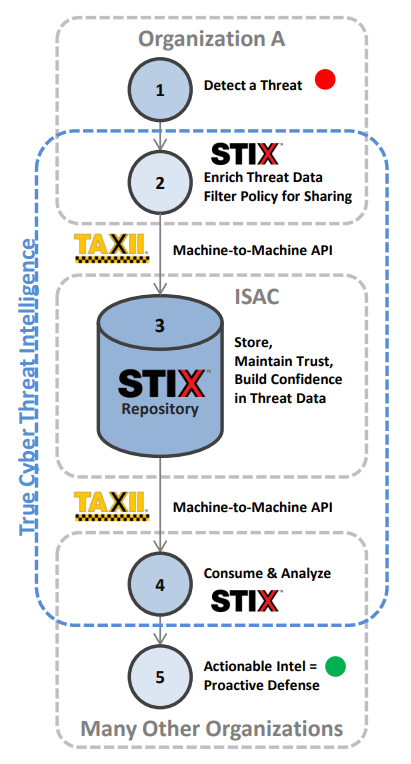

# CTI with NLP
CTI (Cyber Threat Intelligence) with NLP (KOR &amp; EN)

<br/>

<br/>

### # Instructions (Install In Windows10)

```powershell
# Run Windows Terminal as administrator

# Creating a virtual environment
> python -m venv venv
> .\venv\Scripts\Activate.ps1
> python -m pip install --upgrade pip
> pip install -r requirements.txt

> git clone https://github.com/pytorch/fairseq
> cd .\fairseq\
> pip install --editable ./

> git clone https://github.com/kakaobrain/pororo.git
> cd .\pororo\

# MODIFY setup.py
# long_description=open("README.md", 'rt', encoding='UTF8').read(),
> pip install --editable ./

# Shut down the virtual environment
> deactivate
```

<br/>

<br/>

### # STIX / TAXI

> https://www.anomali.com/resources/what-are-stix-taxii

STIX and TAXII are standards developed in an effort to improve the prevention and mitigation of cyber-attacks.

STIX states the what of threat intelligence, while TAXII defines how that information is relayed. Unlike previous methods of sharing, STIX and TAXII are machine-readable and therefore easily automated.



<br/>

<br/>

### # KakaoBrain PORORO (Platform Of neuRal mOdels for natuRal language prOcessing)

`pororo` performs Natural Language Processing and Speech-related tasks.

It is easy to solve various subtasks in the natural language and speech processing field by simply passing the task name.

<br/>